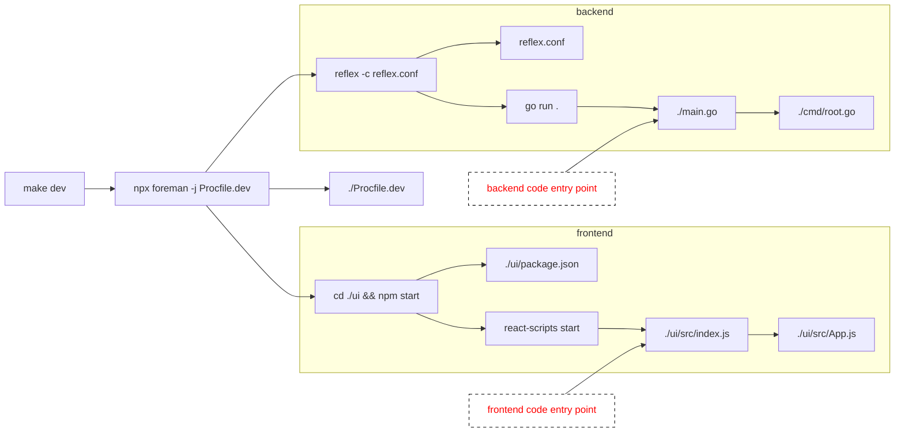

## Development Server

```mermaid
flowchart LR
    dev[make dev]
    dev --> foreman[npx foreman -j Procfile.dev] --> ./Procfile.dev

    foreman --> npm
    foreman --> reflex

    subgraph frontend
    npm[cd ./ui && npm start] --> ./ui/package.json
    npm --> react[react-scripts start] --> js[./ui/src/index.js] --> ./ui/src/App.js
    end


    subgraph backend
    reflex[reflex -c reflex.conf] --> reflex.conf
    reflex --> run[go run .] --> go[./main.go] --> ./cmd/root.go   
    end

    entry[frontend code entry point] --> js
    entry2[backend code entry point] --> go
    style entry fill:white,color:red,stroke:black,stroke-dasharray:5
    style entry2 fill:white,color:red,stroke:black,stroke-dasharray:5
```
